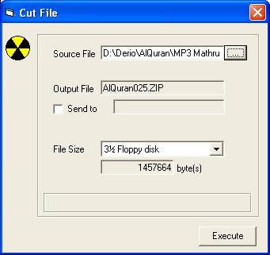



## CutFile

### Description

I have some problems when sending eMail with a large file size as attachment. First, some mail server set a quota for that eMail. The second problem is coming when the recipient download the attachment. It takes long time to download, or when connection broken (because of time), he/she must re-download it, again and again. I imagine why we don&#8217;t create a program to cut the large file into peaces, and then send it one by one via eMail. After that you combine all of the attachments and become the original one.
 
### More Info
 

             |
---                |---
**Submitted On**   |2005-07-19 05:00:04
**By**             |[Derio](https://github.com/Planet-Source-Code/PSCIndex/blob/master/ByAuthor/derio.md)
**Level**          |Beginner
**User Rating**    |4.7 (28 globes from 6 users)
**Compatibility**  |VB 3\.0, VB 4\.0 \(16\-bit\), VB 4\.0 \(32\-bit\), VB 5\.0, VB 6\.0
**Category**       |[Files/ File Controls/ Input/ Output](https://github.com/Planet-Source-Code/PSCIndex/blob/master/ByCategory/files-file-controls-input-output__1-3.md)
**World**          |[Visual Basic](https://github.com/Planet-Source-Code/PSCIndex/blob/master/ByWorld/visual-basic.md)
**Archive File**   |[CutFile1914997192005\.zip](https://github.com/Planet-Source-Code/derio-cutfile__1-61776/archive/master.zip)

